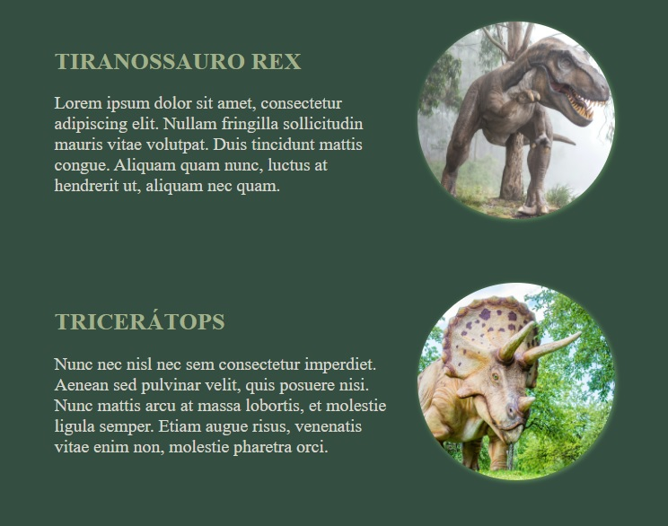
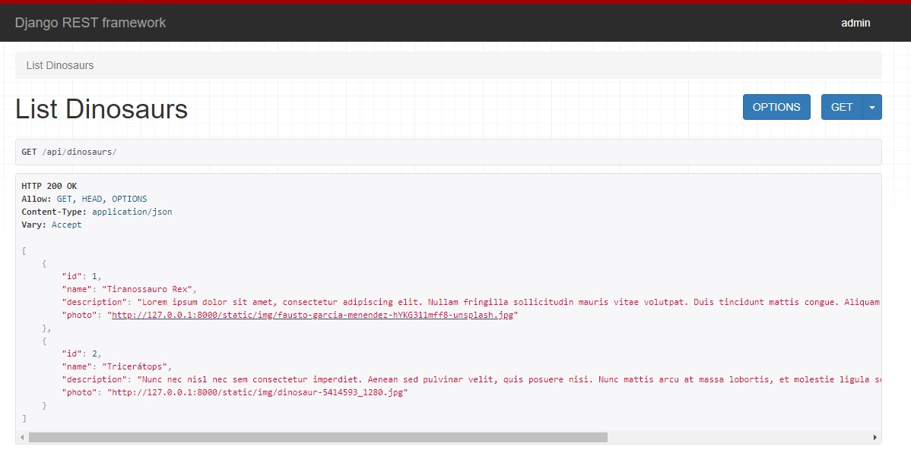

# Dino Project

Este é um projeto em Django com Django Rest Framework para aula de recursos computacionais no ensino da matemática.

## Requisitos

- python 3.8
- Windows 10

## Setup inicial

- Os comandos a seguir devem ser digitados no terminal:

```bash
mkdir django-project
cd django-project
python3 -m venv myvenv
. myvenv/Scripts/activate
pip install django
pip install djangorestframework
pip install pillow
django-admin startproject dinopedia
cd dinopedia
```

- Para testar digitar `python manage.py runserver` no terminal e, depois no navegador de internet, digitar _http://localhost:8000_

## Criando o Models do app e adicionando ao admin

- Digitar no terminal `python manage.py startapp dinosaurs`
- Incluir `'rest_framework'` e `'dinosaurs'` em `INSTALLED_APPS`, no arquivo _settings.py_
- Criar o model do app em _dinosaurs/models.py_
- Liberar o model criado para o admin em _dinousaurs/admin.py_
- Fazer as migrations e executar as mesmas, em seguida criar o superuser. Para isso, no terminal:

```bash
python manage.py makemigrations
python manage.py migrate
python manage.py createsuperuser
```

- Para testar digitar `python manage.py runserver` no terminal e, depois no navegador de internet, digitar _http://localhost:8000/admin_
- Adicione 2 dinossauros para teste.

## Criando views para a api

- Criar serializers em _dinosaurs/serializers.py_
- Criar view para **Listar** dinossauros
- Criar url em _core/urls.py_ para acessar a view criada
- Para testar digitar `python manage.py runserver` no terminal e, depois no navegador de internet, digitar _http://localhost:8000/api/dinosaurs_

## Renderizando arquivos estáticos em desenvolvimento

- No arquivo _core/urls.py_ adicione:

```python
from django.conf import settings
from django.conf.urls.static import static

urlpatterns += static(settings.STATIC_URL, document_root=settings.STATIC_ROOT)
```

- No arquivo _core/settings.py_ adicione:

```python
import os

STATICFILES_DIRS = (os.path.join(BASE_DIR, 'static'), )
STATIC_ROOT = os.path.join(BASE_DIR, 'staticfiles')
```

- Para testar digitar `python manage.py runserver` no terminal e, depois no navegador de internet, digitar _http://localhost:8000/api/dinosaurs_. Entre em alguma url apresentada no campo "photo". A imagem deve ser mostrada no navegador.

## Renderizando templates

- Criar view para renderizar template em _dinosaurs/view.py_
- Criar template (HTML + jinja) em _dinousaurs/templates/index.html_
- Criar estilos em _static/css/styles.css_
- Criar scripts em _static/js/custom.js_
- Criar url para esta view em _core/urls.py_

## Deploy on Heroku

- Instalar gunicorn: `pip install gunicorn`
- Instalar whitenoise: `pip install whitenoise`
- Instalar django-heroku: `pip install django-heroku`
- Criar _Procfile_
- Criar _requirements.txt_
- Adicionar whitenoise em _settings.py_
- Adicionar `STATIC_ROOT` em _settings.py_
- Adicionar no topo de _settings.py_: `import django_heroku`
- Adicionar no final de _settings.py_: `django_heroku.settings(locals())`
- Fazer as migrations e executar as mesmas, em seguida criar o superuser. Para isso, no terminal do heroku:

```bash
python manage.py makemigrations
python manage.py migrate
python manage.py createsuperuser
```

## Armazenando imagens com cloudinary

Heroku não compartilhar arquivos do sistema publicamente. Sendo assim é necessário um serviço para tratar as imagens.

- Instale cloudinary: `pip install cloudinary`
- Atualize os _requirements.txt_

- Em _settings.py_:

```python
import cloudinary

cloudinary.config(cloud_name='<YOUR_CLOUD_NAME>',
                  api_key='<YOUR_API_KEY>',
                  api_secret='<YOUR_API_SECRET>')

INSTALLED_APPS = [
 '...',
 'cloudinary'
]
```

Em _dinosaurs/models.py_:

```python
from cloudinary.models import CloudinaryField
  '...'
  photo = CloudinaryField('image', null=True, blank=True)
```

## Como fica a aplicação

### Web Page

<h1 align="center">
  
</h1>

### Api

<h1 align="center">
  
</h1>

## Referências

- Building APIs with Django and Django Rest Framework (https://books.agiliq.com/)
